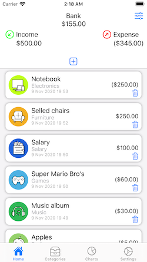
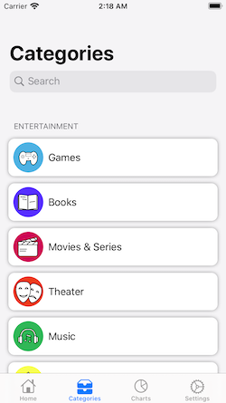
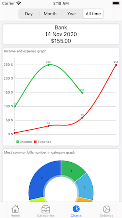

# InvoiceManager
Apps for managing your finances. Add bills by categories and track of your finances using charts
Can import or export backup files with finances data.
Backups are encrypted.

# Used frameforks/librarys 
1. CoreData
2. Locksmith
3. TOPasscodeViewController
4. Charts
5. AESCryptable

# Screenshots

